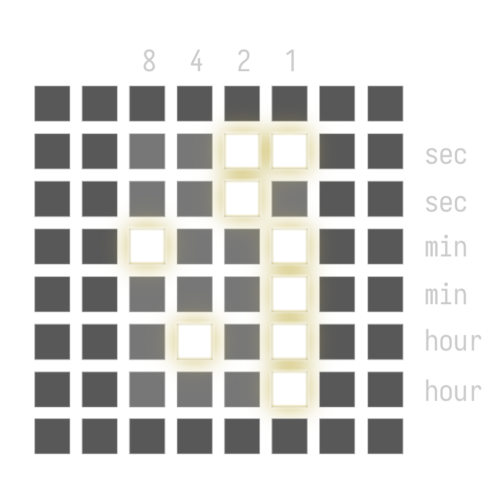

# lpx-binary-clock
Small utility to display hour in a binary format on the Novation's Launchpad X.

<p align="center">
  
</p>

Hours, minutes and seconds are displayed one digit per row, 4 bits per digit with LSB on the right. This yields a 6x4 rectangle centered on the 8x8 LPX grid.

<p align="center">
  
</p>

## How to use
1. Clone the repo.
```bash
gh repo clone alelouis/lpx-binary-clock
```
2. Run the main binary.
```
cargo run
```
